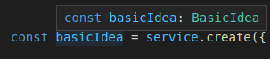
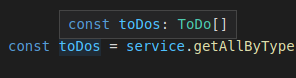

# How to use
1. Use node version 12
2. Run ```npm i```
3. Run ```npm run test```

## Notes
- Tests are in test.ts. I didn't use jest/mocha as a test framework, just imported assert to validate results of idea service.
- Tests are covering:
    - Create entites
    - Update entities
    - Partial update entities
    - Check if notification sent out about the creations / updates described in the specification
    - Getting the correct count of elements back from repository
    - Error handling

- The implementation fulfills the requirements like:
    - create should accept all entity types and return the appropriate type
    - update should accept all entity types and return the appropriate type
    - sending out notifications in the specified cases
    - if we add new properties to entities, but not to the notification properties constant, then ts validation fails

- Typescript helps a lot to avoid introduce errors in the code, but obviously it can't validate all cases.
It is convenient, that during writing code / tests we don't need to focus on property validation, rather code logic testing.


# CCal back-end developer technical test
Your main goal is to implement missing methods in [`IdeaService`](idea-service.ts), this consists of several smaller tasks:
1.  Define types for:
      - `BasicIdea`: Base type, contains `description` and `title` fields.
      - `ToDo`: Similar to `BasicIdea`, contains also `done` field.
      - `Concept`: Similar to `ToDo`, contains optional `done` and `references` fields, `references` is an array of URLs (strings).

    Use these types in other tasks, don't forget about `repository`. Please think of a way how we can easily distinguish idea types.

2.  Implement `create` method, it should accept all idea types and return the corresponding, concrete type. Use `repository` to store the input.
3.  Implement `update` method, it should accept update for all idea types. Bonus points if it accepts partial update.

    Additionally, we must ensure that if `title` in `BasicIdea`, `done` in `ToDo` or `references` in `Concept` are changed we call the Notification service.

    Please bear in mind that in the future we may need to notify about other fields update as well.
    We need to ensure that we won't forget about any new fields added in the future.

    Use `repository` to store the update and `notificationService` to notify about the update.
4.  Implement `getAllByType` method, it accepts idea type and returns an array of the corresponding, concrete types.

    Use `repository` to fetch ideas.
5.  Write unit tests for `IdeaService` class. For simplicity don't bother with `repository`.


We are looking for **clean TypeScript code**, with **no duplication**.
The usage of `any` should be as limited as possible, please annotate **parameters and variables with concrete types**, but please do not clutter your code with **inferable types**.

## Notes
- You can install additional dependencies (e.g for unit tests) but please keep them minimal and write your solutions with pure TypeScript.
- Think of validation and error handling. Please describe in the comment (or implement) what's your idea for these topics.
- Bonus points for advanced TypeScript solutions like conditional type instead of method overloads, mapped types etc.
- Suggestion: use `type` instead of `interface` to get the most out of the "types algebra".
- Do not afraid to use types assertion but do it wisely.
- There is no single correct solution for these tasks, be creative, use your best effort and knowledge. We will discuss your ideas during the interview.
- The phrase "concrete type" means that we are looking to see as narrow type as possible:  
      
    
